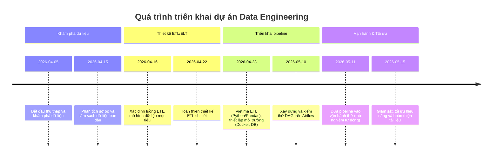

# Tóm tắt điều hành
Để thực hiện một dự án Data Engineering thực tế (ví dụ xây dựng hệ thống ETL xử lý dữ liệu từ nhiều nguồn), trước hết cần rõ **mục tiêu** và **nguồn dữ liệu** khả thi. Báo cáo này đề xuất 2–3 ý tưởng dự án thực tế (kèm mục tiêu, loại dữ liệu, nguồn và quy mô ước tính). Tiếp đó, dự án được chia thành các giai đoạn: **Khám phá dữ liệu**, **Thiết kế ETL/ELT**, **Triển khai pipeline**, **Vận hành & tối ưu**. Mỗi giai đoạn gồm mục tiêu, các công việc cụ thể (mục đích, đầu vào/ra, checklist), ước lượng thời gian, kiến thức và công cụ cần thiết. Báo cáo cũng giới thiệu một **stack công cụ cụ thể** (Python, Pandas, Airflow, PostgreSQL, Docker, AWS/GCP) kèm lý do lựa chọn và hướng dẫn cơ bản (các lệnh cơ bản). Đề xuất lộ trình học tập từ căn bản đến thành thạo (Python, SQL, Linux, Docker, Airflow…) với ước lượng thời gian. Ngoài ra có bảng so sánh khoảng 6 công cụ theo độ khó, chi phí, thân thiện với người mới và khả năng mở rộng. Cuối cùng là nguồn dữ liệu mẫu và notebook hữu ích (từ các trang chính thức, GitHub…). 



## 1. Ý tưởng dự án thực tế
**Ý tưởng 1:  Ứng dụng phân tích dữ liệu bán lẻ** – Xây dựng pipeline ETL tổng hợp dữ liệu bán hàng từ cửa hàng trực tuyến/quầy hàng. *Mục tiêu*: Phân tích doanh thu, tồn kho, xu hướng khách hàng để hỗ trợ kinh doanh. *Dữ liệu cần*: Dữ liệu đơn hàng (mã sản phẩm, thời gian, số lượng, giá), khách hàng (id, giới tính, độ tuổi), tồn kho. *Nguồn dữ liệu khả thi*: API của hệ thống bán hàng, file CSV/XLS đặt hàng, hoặc dataset ví dụ (Kaggle). Ví dụ có thể dùng bộ dữ liệu bán hàng bán lẻ công khai trên Kaggle hoặc thu thập dữ liệu đơn giản từ web (nếu trang demo). *Quy mô dữ liệu*: Từ vài chục ngàn đến vài trăm nghìn bản ghi đơn hàng, tùy quy mô cửa hàng. (Ví dụ: 100,000 đơn hàng/năm, dữ liệu lớn nếu mở rộng nhiều cửa hàng và thời gian dài.) 

**Ý tưởng 2: Hệ thống ETL dữ liệu cảm biến IoT (ví dụ: cảm biến giao thông hoặc thời tiết)** – Triển khai pipeline thu thập và xử lý dữ liệu thời gian thực hoặc định kỳ từ các cảm biến. *Mục tiêu*: Xây dựng cơ sở dữ liệu và báo cáo (dashboard) theo thời gian thực để giám sát (ví dụ lưu lượng xe, chất lượng không khí, nhiệt độ). *Dữ liệu cần*: Dữ liệu cảm biến (timestamp, giá trị đo – ví dụ số xe qua trạm, nhiệt độ, độ ẩm). *Nguồn dữ liệu khả thi*: Dữ liệu mở thành phố (nếu có), API cung cấp dữ liệu IoT công cộng, hoặc sử dụng bộ dữ liệu thử nghiệm (VD: NOAA weather, Kaggle traffic sensors). *Quy mô dữ liệu*: Cao tần suất; có thể hàng nghìn bản ghi mỗi phút. Ví dụ nếu 10 sensor lấy mẫu mỗi phút, 1 ngày ~14 triệu bản ghi. Cần cân nhắc xử lý dữ liệu lớn: lúc đầu có thể giả lập (vd. ghi âm thí nghiệm trên 1.000.000 bản ghi). 

**Ý tưởng 3: Phân tích dữ liệu mạng xã hội/Tin tức** – Thu thập và xử lý luồng dữ liệu mạng xã hội (Twitter, Facebook, blog tin tức) về một chủ đề cụ thể. *Mục tiêu*: Cung cấp báo cáo xu hướng, tần suất xuất hiện chủ đề, phân tích tình cảm. *Dữ liệu cần*: Văn bản bài đăng, timestamp, tác giả/nguồn. *Nguồn dữ liệu khả thi*: API Twitter, API báo chí, feed RSS. Có thể dùng bộ dữ liệu ví dụ trên Kaggle (ví dụ Tashkent, Golden Retriever Tweets…). *Quy mô dữ liệu*: Phụ thuộc vào thời gian thu thập; ví dụ 1.000–10.000 bài đăng/ngày. Đủ lớn để xử lý ETL và khám phá NLP ban đầu nhưng không quá khổng lồ (có thể lưu trữ vào DB quan hệ hoặc NoSQL). 

*Ghi chú:* Với cả 3 ý tưởng, yêu cầu là xây dựng pipeline hoàn chỉnh (ETL) để biến dữ liệu thô thành dữ liệu sạch phục vụ truy vấn/báo cáo. Nếu có phần nào “không xác định” (ví dụ chi tiết API), ghi chú rõ “không xác định” và giả sử dữ liệu ở dạng phổ biến (CSV, JSON, API REST). 

## 2. Phân chia giai đoạn dự án
Dự án được chia thành 4 giai đoạn chính. Mỗi giai đoạn bao gồm mục tiêu cụ thể, danh sách công việc, ước lượng thời gian, kiến thức & công cụ cần có. Các công việc chi tiết (mục đích, đầu vào/đầu ra, checklist kỹ thuật) được trình bày dưới dạng mục lục.

### Giai đoạn 1: Khám phá dữ liệu (Data Exploration)
**Mục tiêu**: Hiểu rõ dữ liệu đầu vào, đánh giá chất lượng, xác định dữ liệu thô cần thu thập.  

- **Thời gian ước lượng**: ~1–2 tuần (khoảng 40–80 giờ) tùy khối lượng dữ liệu.  
- **Kiến thức cần có**: Python cơ bản, Pandas, SQL (đọc bảng), xử lý dữ liệu sơ bộ, Excel.  
- **Công cụ đề xuất**: Python (Jupyter Notebook), Pandas, công cụ cơ sở dữ liệu (PostgreSQL hoặc SQLite), Excel (không bắt buộc).  

**Công việc cụ thể**:
- **Công việc 1: Tìm và thu thập dữ liệu**. *Mục đích*: Lấy các nguồn dữ liệu mẫu để khám phá. *Đầu vào*: Đường dẫn file (CSV, JSON) hoặc API. *Đầu ra*: File dữ liệu thô hoặc bảng staging ban đầu. *Checklist*:
  1. Xác định định dạng dữ liệu (CSV/JSON/DB).
  2. Nếu là API/Web: gọi API (requests) hoặc web-scrape (nếu cần) để thu thập. Nếu file: tải xuống.  
  3. Lưu trữ dữ liệu thô vào thư mục “data/raw” hoặc bảng cơ sở dữ liệu sơ khai.  
  4. Đảm bảo lưu bản sao gốc (phòng khi cần kiểm tra lại).  

- **Công việc 2: Kiểm tra & phân tích sơ bộ dữ liệu (Data Profiling)**. *Mục đích*: Đánh giá chất lượng và cấu trúc dữ liệu. *Đầu vào*: Dữ liệu thô thu thập. *Đầu ra*: Báo cáo/tóm tắt thống kê (ứng dụng Pandas Profiling hoặc summary) và phát hiện vấn đề. *Checklist*:
  1. Dùng Pandas: `df = pd.read_csv(...)` (hoặc đọc JSON/DB).  
  2. Xem thông tin cột (`df.info()`), thống kê (`df.describe()`), số dòng, tỷ lệ null, duplicates.  
  3. Vẽ biểu đồ/tỷ lệ phân bố (có thể dùng Pandas, Matplotlib).  
  4. Đánh dấu vấn đề: cột thiếu, giá trị bất thường (outliers), sai định dạng.  
  5. Ghi chú kết quả profiling.  

- **Công việc 3: Tiền xử lý sơ bộ (Data Cleaning ban đầu)**. *Mục đích*: Loại bỏ lỗi dữ liệu cơ bản. *Đầu vào*: Dữ liệu thô có vấn đề. *Đầu ra*: Dữ liệu sạch tạm (có thể lưu trong `data/cleaned`). *Checklist*:
  1. Loại bỏ hoặc thay thế dòng/rỗng sai lệch (dropna/fillna).  
  2. Chuẩn hóa định dạng cột (chuyển sang date/time, số).  
  3. Loại bỏ duplicate (nếu có).  
  4. Kiểm tra và fix encoding (UTF-8 cho tiếng Việt).  
  5. Xuất dữ liệu đã xử lý sơ bộ (CSV/DB).  

**Công việc 4: Báo cáo kết quả**. Tổng hợp những gì học được từ dữ liệu đầu tiên: dung lượng, độ phức tạp, thách thức. Đây sẽ làm đầu vào cho giai đoạn thiết kế ETL.

### Giai đoạn 2: Thiết kế ETL/ELT (ETL/ELT Design)
**Mục tiêu**: Xây dựng kế hoạch chi tiết cho pipeline ETL/ELT, bao gồm thiết kế cấu trúc dữ liệu đích (Data Warehouse hay Data Mart), xác định các bước transform.  

- **Thời gian ước lượng**: ~1 tuần (khoảng 30–40 giờ).  
- **Kiến thức cần có**: Mô hình dữ liệu (dimensional modelling, Kimball…), SQL (tạo bảng, quản lý schema), UML sơ đồ.  
- **Công cụ đề xuất**: Công cụ vẽ sơ đồ (draw.io, diagram.ly), Python để thử ý tưởng transform, PostgreSQL để thử nghiệm mô hình DB.  

**Công việc cụ thể**:
- **Công việc 1: Thiết kế mô hình dữ liệu đích**. *Mục đích*: Định nghĩa bảng phân tích (fact, dimension) hoặc schema cho phân tích. *Đầu vào*: Hiểu biết về dữ liệu (từ giai đoạn 1). *Đầu ra*: Sơ đồ ERD/Data Warehouse (ERD hay star schema). *Checklist*:
  1. Xác định các **thực thể chính** (ví dụ sản phẩm, khách hàng, thời gian, doanh thu).  
  2. Định nghĩa bảng fact (sự kiện: đơn hàng) và dimension (thuộc tính: sản phẩm, khách hàng, thời gian).  
  3. Vẽ sơ đồ ERD (với công cụ diagram) gồm khóa chính/ngoại.  
  4. Chuẩn bị script SQL tạo bảng mẫu (PostgreSQL): xác định kiểu dữ liệu, ràng buộc.  

- **Công việc 2: Định nghĩa quy trình ETL/ELT chi tiết**. *Mục đích*: Lên kế hoạch chi tiết cách di chuyển và biến đổi dữ liệu từ nguồn vào bảng đích. *Đầu vào*: Yêu cầu báo cáo và mô hình dữ liệu. *Đầu ra*: Tài liệu mô tả các bước ETL. *Checklist*:
  1. Liệt kê nguồn dữ liệu (file, DB, API) và định dạng.  
  2. Xác định cách **Extract**: đọc file, gọi API, truy vấn DB nguồn.  
  3. Định nghĩa **Transform**: các bước xử lý (ví dụ: tính doanh thu = số_lượng * giá, chuẩn hóa tên, gom nhóm).  
  4. Định nghĩa **Load**: bản ghi được ghi vào đâu (PostgreSQL), sử dụng INSERT hoặc COPY.  
  5. Tùy chọn: Dùng ELT hay ETL (với lượng dữ liệu nhỏ, có thể ETL thuần; nếu lớn, có thể ELT load raw rồi xử lý ở DB).  
  6. Ghi chú các công cụ: ví dụ Python/Pandas cho transform, SQL để load.  

- **Công việc 3: Lập kế hoạch lịch trình và kiểm thử**. *Mục đích*: Xác định tần suất chạy ETL và tiêu chí kiểm thử. *Đầu vào*: Đặc điểm dữ liệu (liên tục hay lô). *Đầu ra*: Lịch chạy định kỳ (cron/Airflow schedule) và kế hoạch test. *Checklist*:
  1. Quyết định chạy theo: thời gian thực (real-time), theo lịch (hàng ngày, hàng giờ).  
  2. Đặt tiêu chuẩn kiểm thử: kiểm tra lỗi đầu vào mới, tính nhất quán (dùng các câu SELECT kiểm tra số dòng, tổng, min/max).  
  3. Chuẩn bị test script: dùng Python hoặc SQL để so sánh kết quả mong đợi.  
  4. Lập lịch sơ bộ (ví dụ: hàng ngày 6:00 AM).  

### Giai đoạn 3: Triển khai pipeline (Implementation & Deployment)
**Mục tiêu**: Xây dựng mã nguồn và cấu hình pipeline ETL như đã thiết kế, sau đó kiểm thử và chuẩn bị môi trường chạy liên tục.  

- **Thời gian ước lượng**: ~2–3 tuần (80–120 giờ). Giai đoạn này thường dài nhất (viết code, debug, test).  
- **Kiến thức cần có**: Python nâng cao, Pandas, SQL (INSERT, COPY), Airflow (tạo DAG, Operators), Docker cơ bản, Git, Linux.  
- **Công cụ đề xuất**: Python (câu lệnh `pip`, môi trường ảo), Pandas, PostgreSQL (hoặc MySQL/SQLite nếu cần nhẹ), Docker (tạo image), Airflow (tạo và chạy DAG).  

**Công việc cụ thể**:
- **Công việc 1: Code Extract (đọc dữ liệu)**. *Mục đích*: Viết script đọc/thu thập dữ liệu đầu vào. *Đầu vào*: File hoặc API/DB nguồn. *Đầu ra*: DataFrame Pandas hoặc file tạm. *Checklist*:
  1. Viết Python script (file `extract.py`) sử dụng pandas (`pd.read_csv` hoặc `requests.get` rồi `pd.DataFrame`).  
  2. Xử lý lấy đủ cột cần thiết, lọc dữ liệu ban đầu (nếu cần).  
  3. Lưu kết quả tạm ra định dạng chuẩn (CSV, JSON, hoặc lưu trực tiếp vào PostgreSQL staging).  
  4. Kiểm thử: chạy script và xác nhận đầu ra hợp lệ (kiểm tra số dòng, kiểu dữ liệu).  

- **Công việc 2: Code Transform (xử lý dữ liệu)**. *Mục đích*: Viết logic biến đổi theo thiết kế. *Đầu vào*: Dữ liệu thô (DataFrame hoặc file tạm). *Đầu ra*: Dữ liệu đã biến đổi, sẵn sàng load. *Checklist*:
  1. Viết Python script (`transform.py`) đọc dữ liệu từ bước Extract (hoặc dùng Pandas để nối các DataFrame).  
  2. Thực hiện phép tính, gộp bảng, chuyển đổi kiểu (ví dụ: tính doanh thu, chuyển ngày về chuẩn ISO).  
  3. Áp dụng xử lý dữ liệu thiếu/loại bỏ duplicat (nếu cần).  
  4. Kết quả transform = DataFrame cuối cùng cho mỗi bảng đích.  
  5. Kiểm thử: dùng `df.to_sql` thử lưu tạm vào PostgreSQL hoặc `df.head()` xem kết quả.  

- **Công việc 3: Code Load (ghi dữ liệu vào DB)**. *Mục đích*: Đưa dữ liệu đã xử lý vào hệ quản trị (Data Warehouse). *Đầu vào*: DataFrame của Transform. *Đầu ra*: Dữ liệu trong DB (PostgreSQL). *Checklist*:
  1. Chuẩn bị kết nối đến PostgreSQL (ví dụ dùng `psycopg2` hoặc `sqlalchemy`).  
  2. Tạo các table đích theo ERD đã thiết kế (nếu chưa có).  
  3. Dùng `df.to_sql()` hoặc `COPY` để chèn dữ liệu. 
  4. Đảm bảo cập nhật incremental (nếu chạy định kỳ, tránh trùng). Có thể xóa toàn bộ và load lại (đơn giản) hoặc dùng UPSERT.  
  5. Kiểm thử: sau load, dùng SQL kiểm tra số bản ghi, tổng số, kết quả mẫu.  

- **Công việc 4: Cấu hình Airflow để tự động hóa**. *Mục đích*: Thiết lập workflow tự động chạy các script trên. *Đầu vào*: Các script (extract.py, transform.py, load.py). *Đầu ra*: DAG Airflow có thể lên lịch chạy. *Checklist*:
  1. Cài đặt Airflow (theo hướng dẫn chính thức). Ví dụ: `pip install apache-airflow==2.3.3`【22†L143-L151】.  
  2. Tạo file DAG Python (ví dụ `data_pipeline.py` trong thư mục `dags/`). Trong DAG, định nghĩa các task: BashOperator/PythonOperator gọi lần lượt Extract, Transform, Load scripts.  
  3. Đặt phụ thuộc: Extract >> Transform >> Load (sử dụng `task1 >> task2 >> task3`).  
  4. Chạy thử local: khởi chạy `airflow scheduler` và `airflow webserver -p 8080`【22†L143-L151】, theo dõi UI xem DAG đã kích hoạt.  
  5. Sửa lỗi khi có ngoại lệ.  
  6. Đặt lịch (e.g. daily) cho DAG.  

- **Công việc 5: Tạo môi trường chạy (Docker)**. *Mục đích*: Chuẩn bị môi trường đồng nhất và dễ triển khai. *Đầu vào*: Mã nguồn và Dockerfile. *Đầu ra*: Image Docker chứa Python và các script. *Checklist*:
  1. Viết `Dockerfile` chứa: base image Python (ví dụ `python:3.11-slim`), copy mã vào container, cài đặt dependencies (pandas, sqlalchemy, psycopg2, airflow….)【20†L101-L110】.  
  2. Tạo image: `docker build -t my-data-engineer-project .`【20†L146-L152】.  
  3. Tạo container gồm cả Airflow và PostgreSQL: có thể dùng Docker Compose (khai báo dịch vụ airflow, db).  
  4. Khởi chạy container: `docker run my-data-engineer-project`. Đảm bảo cả các service chạy (sử dụng lệnh như trong [31†L235-L239] để khởi container Postgres).  
  5. Kiểm tra trong container: chạy lệnh psql để kiểm tra DB, chạy Airflow UI.  

- **Công việc 6: Kiểm thử toàn bộ pipeline**. *Mục đích*: Đảm bảo luồng ETL hoạt động đầu đến cuối. *Đầu vào*: Pipeline đã triển khai. *Đầu ra*: Kết quả đúng, quy trình ổn định. *Checklist*:
  1. Chạy hoàn chỉnh một lần: gọi Airflow, quan sát các task.  
  2. Kiểm tra bảng đích: dữ liệu chính xác, thống kê hợp lý.  
  3. Mô phỏng tình huống lỗi (ví dụ mất kết nối DB) để xem DAG có retry/alert.  
  4. Ghi lại các bước phát hiện và sửa lỗi.  

### Giai đoạn 4: Vận hành & tối ưu hóa (Operation & Optimization)
**Mục tiêu**: Đưa pipeline vào môi trường vận hành (có thể là server hoặc cloud), giám sát, bảo trì và cải thiện hiệu suất.  

- **Thời gian ước lượng**: ~1 tuần cho thiết lập ban đầu + công việc liên tục.  
- **Kiến thức cần có**: Đảm bảo vận hành: Linux (cron, systemd), Airflow monitoring, tuning SQL, Docker nâng cao, nếu dùng cloud thì AWS/GCP cơ bản.  
- **Công cụ đề xuất**: Airflow UI, syslog/monitoring (ví dụ Grafana nếu muốn), dịch vụ cloud (AWS RDS/S3 hoặc GCP BigQuery nếu dùng).  

**Công việc cụ thể**:
- **Công việc 1: Triển khai pipeline trên môi trường thực**. *Mục đích*: Đưa code lên server hoặc đám mây. *Đầu vào*: Code và Docker image. *Đầu ra*: Pipeline chạy liên tục (scheduler). *Checklist*:
  1. Nếu dùng máy chủ riêng: deploy Docker image lên server, chạy background (Docker Compose).  
  2. Nếu dùng cloud: đẩy code lên GitHub, dùng CI/CD (ví dụ GitHub Actions) để triển khai trên AWS ECS/EKS hoặc Compute Engine.  
  3. Thiết lập AWS/GCP: đảm bảo database (RDS/Aurora hoặc Cloud SQL), storage (S3/GCS) đã được cấu hình (nếu cần).  
  4. Cấu hình biến môi trường (credentials, secrets) cho container/Airflow.  
  5. Đảm bảo Airflow scheduler đang chạy theo lịch.  

- **Công việc 2: Giám sát và quản lý pipeline**. *Mục đích*: Đảm bảo pipeline hoạt động ổn định, phát hiện lỗi tự động. *Đầu vào*: Pipeline đang chạy. *Đầu ra*: Báo cáo trạng thái, cảnh báo lỗi. *Checklist*:
  1. Sử dụng Airflow UI để xem lịch sử chạy, cảnh báo (có email alert nếu cấu hình).  
  2. Thiết lập logging (Airflow, logs Python, logs DB).  
  3. Viết script kiểm tra integrity định kỳ (ví dụ: xác nhận số lượng bản ghi hàng ngày).  
  4. Nếu có giám sát, cấu hình Grafana/Prometheus (tuỳ chọn) để giám sát CPU/memory.  

- **Công việc 3: Tối ưu hóa hiệu năng**. *Mục đích*: Nâng cao hiệu quả xử lý khi dữ liệu tăng. *Đầu vào*: Dữ liệu hiện tại, pipeline chạy. *Đầu ra*: Pipeline tối ưu (thời gian chạy nhanh hơn, ít lỗi). *Checklist*:
  1. Tối ưu SQL (tạo index cho các trường JOIN/GROUP BY).  
  2. Xem memory của Pandas: nếu quá lớn, chia nhỏ batch hoặc dùng chunk.  
  3. Cân nhắc dùng Spark nếu dữ liệu vượt mức Pandas (**Spark** có khả năng mở rộng tốt hơn cho dữ liệu lớn【24†L64-L71】【15†L258-L264】).  
  4. Điều chỉnh tài nguyên (thêm CPU/memory cho container nếu cần).  
  5. Tinh chỉnh Airflow: tăng workers hoặc chuyển sang distributed mode.  

- **Công việc 4: Cập nhật và bảo trì**. *Mục đích*: Đảm bảo pipeline luôn cập nhật. *Đầu vào*: Yêu cầu thay đổi, cập nhật công cụ mới. *Đầu ra*: Phiên bản pipeline mới. *Checklist*:
  1. Nếu schema nguồn thay đổi, cập nhật script tương ứng.  
  2. Giám sát lỗi phát sinh (dependency lỗi, API hết hạn).  
  3. Cập nhật phiên bản Python/Pandas/Airflow nếu cần (sử dụng Docker để dễ nâng cấp).  
  4. Tài liệu hoá quy trình (README, wiki).  

> **Chú ý:** Ví dụ “ngân hàng xử lý hàng tỷ giao dịch mỗi ngày”【3†L258-L266】 cho thấy tầm quan trọng của tự động hóa quy trình và công cụ mạnh (Python, Pandas) trong dự án Data Engineer. Công cụ như Airflow giúp **lập lịch và giám sát** công việc, giảm bớt lỗi thủ công【18†L77-L84】【15†L272-L280】. 

## 3. Công cụ đề xuất và hướng dẫn bắt đầu
Chúng tôi đề xuất một stack đơn giản, phổ biến, miễn phí/chi phí thấp:

- **Python** (miễn phí, ngôn ngữ chính): Lý do: ngôn ngữ “đinh” trong dữ liệu【44†L109-L115】, dễ học, có nhiều thư viện hỗ trợ. *Bắt đầu*: Cài Python 3.x từ [python.org] hoặc qua Anaconda; kiểm tra `python --version`. Dùng `pip` cài thêm: `pip install pandas psycopg2-binary`【29†L134-L139】. Viết script `.py`, chạy bằng `python script.py`.  
- **Pandas** (thư viện Python, miễn phí): Xử lý dữ liệu dạng bảng linh hoạt【29†L74-L82】. Lý do: thao tác DataFrame đơn giản, nhiều hàm tích hợp (merge, groupby, xử lý thiếu…)【29†L101-L110】【29†L121-L130】. *Bắt đầu*: `pip install pandas`【29†L134-L139】, rồi trong Python: `import pandas as pd`. Đọc dữ liệu: `pd.read_csv('file.csv')`, thao tác, rồi `df.to_csv` hoặc `to_sql`. Pandas dễ dùng cho dữ liệu vừa phải; nếu dữ liệu vượt vài GB, cân nhắc Spark【24†L64-L71】.  
- **PostgreSQL** (miễn phí, có phiên bản miễn phí): Hệ quản trị quan hệ mạnh mẽ, hỗ trợ SQL chuẩn, mở rộng tốt【31†L100-L107】. Thích hợp lưu trữ dữ liệu phân tích. *Bắt đầu*: Cài đặt PostgreSQL (VD: `sudo apt-get install postgresql` trên Linux). Tạo CSDL: `CREATE DATABASE project_db;`. Tạo bảng theo ERD. Kết nối từ Python qua thư viện `psycopg2` hoặc `sqlalchemy`. Hoặc chạy ngay trong Docker: `docker pull postgres`【31†L197-L200】 rồi `docker run --name my-postgres -e POSTGRES_PASSWORD=matkhau -d postgres`【31†L235-L239】.  
- **Apache Airflow** (miễn phí, Python): Nền tảng lập lịch và giám sát workflows chuẩn mực【18†L77-L84】. Lý do: định nghĩa DAG bằng Python, có UI trực quan, cảnh báo lỗi. *Bắt đầu*: Theo hướng dẫn chính thức: gán biến môi trường (AIRFLOW_HOME, AIRFLOW_VERSION…), sau đó `pip install "apache-airflow==2.3.3" --constraint "https://.../constraints.txt"`【22†L143-L151】. Khởi chạy: `airflow webserver -p 8080` và `airflow scheduler`【22†L143-L151】. Tạo file DAG (ví dụ `dag.py`) trong thư mục `AIRFLOW_HOME/dags/`. Xem ví dụ mẫu trên viblo【22†L179-L188】.  
- **Docker** (miễn phí; chạy container): Đóng gói môi trường (Python, Postgres, Airflow) để triển khai dễ dàng. *Bắt đầu*: Cài Docker Desktop (Windows/Mac) hoặc `sudo apt-get install docker.io` (Linux). Tạo `Dockerfile` (ví dụ base `python:3.11-slim`), copy mã và `RUN pip install -r requirements.txt`. Ví dụ khởi tạo container Python+Pandas như sau (tham khảo【20†L101-L110】): 
    ```dockerfile
    FROM python:3.11-slim
    COPY . /app
    WORKDIR /app
    RUN pip install --no-cache-dir -r requirements.txt
    CMD ["python", "app.py"]
    ```
  Xây dựng image: `docker build -t my-etl .` và chạy: `docker run my-etl`. Đối với Postgres, theo hướng dẫn Docker: `docker pull postgres` và `docker run --name some-postgres -e POSTGRES_PASSWORD=xyz -d postgres`【31†L235-L239】.  
- **AWS/GCP (đám mây cơ bản)**: Tùy chọn (hoặc dùng thay local). Lý do: tài nguyên mở rộng (database, storage, compute) khi cần. AWS có Free Tier cho RDS, S3, Lambda; GCP có BigQuery dùng miễn phí giới hạn. *Bắt đầu*: Tạo tài khoản AWS/GCP. Với AWS: 
  - Dùng AWS RDS để chạy PostgreSQL (Free Tier). 
  - Dùng S3 lưu file lớn. 
  - Tải AWS CLI và cấu hình (`aws configure`). 
  Đối với GCP: sử dụng Cloud SQL (Postgres) và Cloud Storage. Học qua tài liệu chính thức (AWS/GCP tutorial). 

> **Lưu ý stack:** Python + Pandas thuận tiện cho **dữ liệu trung bình** (vài MB–tối đa vài GB)【24†L64-L71】. Airflow chuẩn cho **tự động hóa** luồng công việc【18†L77-L84】. PostgreSQL là DB mã nguồn mở, quy chuẩn ACID, dễ tích hợp【31†L100-L107】. Docker đảm bảo môi trường nhất quán【20†L101-L110】【31†L197-L200】.  

## 4. Lộ trình học tập (cho người mới)
Để phát triển đủ kỹ năng thực hiện dự án, cần học theo thứ tự hợp lý. Dưới đây là gợi ý lộ trình với thời gian ước lượng:  

1. **Python cơ bản (2–4 tuần)** – Nắm vững cú pháp, OOP, thư viện chuẩn. Tập trung vào viết script đơn giản. Lý do: Python là ngôn ngữ “đinh” của data【44†L109-L115】. (Tài liệu: Python.org tutorials).  
2. **Pandas & Numpy (2 tuần)** – Cách dùng DataFrame, xử lý bảng, groupby, merge, đọc/ghi file (CSV, JSON)【29†L101-L110】. Thực hành qua các notebook mẫu (ví dụ DataCamp).  
3. **SQL và cơ sở dữ liệu (2–4 tuần)** – Học SQL (SELECT, JOIN, GROUP BY, DDL/DML). Cài đặt PostgreSQL; thực hành tạo và truy vấn bảng. (Tài liệu SQL từ W3Schools hoặc HackerRank SQL).  
4. **Linux và Git (1–2 tuần)** – Lệnh cơ bản Linux (cd, ls, grep, cron, bash scripting)【44†L132-L136】; Git để quản lý mã (commit, branch, merge). Quan trọng để vận hành server và version control.  
5. **Docker cơ bản (1 tuần)** – Học tạo Dockerfile, build/run container. Chạy thử Postgres trong Docker (theo hướng dẫn Docker Hub)【31†L197-L200】.  
6. **Airflow cơ bản (2 tuần)** – Đọc tutorial Airflow, tạo DAG đầu tiên (ví dụ HelloWorld)【22†L179-L188】. Lý thuyết DAG (luồng DAG scheduling) và cài đặt local.  
7. **Data Modeling/ETL (2 tuần)** – Học khái niệm Data Warehouse, ETL (Kimball), dùng công cụ vẽ ERD. Thực hành thiết kế bảng phân tích. (Tài liệu: Kimball guide).  
8. **Thực hành dự án mẫu (tích lũy trong suốt quá trình)** – Bắt đầu từ dự án nhỏ (ví dụ bộ dữ liệu bán hàng nhỏ), áp dụng tuần tự các bước trên, mở rộng dần. 

*Ước tính tổng thời gian:* khoảng 3–4 tháng học tập tích cực để nắm vững (khoảng 500 giờ). Lộ trình này theo gợi ý trên【44†L109-L118】【44†L121-L128】. Sau đó, thực hiện dự án sẽ cho kinh nghiệm thực hành bổ sung. 

## 5. So sánh công cụ
Bảng dưới so sánh 6 công cụ theo độ khó, chi phí, thân thiện người mới, khả năng mở rộng:

| Công cụ        | Độ khó       | Chi phí            | Người mới   | Khả năng mở rộng (scale) |
|----------------|-------------|--------------------|-------------|--------------------------|
| **Python**     | Dễ         | Miễn phí           | Cao         | Trung bình (tùy cài đặt)  |
| **Pandas**     | Trung bình | Miễn phí           | Cao         | Trung bình (dữ liệu TB => Spark tốt hơn)【24†L64-L71】 |
| **PostgreSQL** | Trung bình | Miễn phí           | Trung bình  | Cao (đa người dùng, dữ liệu lớn)【31†L100-L107】 |
| **Apache Airflow** | Trung bình/Khó | Miễn phí  | Trung bình  | Cao (dựng DAG phức, scale tốt)【18†L77-L84】 |
| **Docker**     | Trung bình | Miễn phí           | Trung bình  | Trung bình (dễ container but devops)【20†L101-L110】 |
| **AWS/GCP**    | Khó        | Free-tier/Trả phí  | Thấp        | Rất cao (hạ tầng đám mây) |
| **Apache Spark** (tùy chọn)| Khó | Miễn phí  | Thấp        | Rất cao (xử lý Big Data)【24†L64-L71】 |

- **Giải thích**: Python/Pandas dễ làm quen【29†L74-L82】, phù hợp xử lý ETL cơ bản; PostgreSQL phổ biến, hoàn toàn miễn phí và mở rộng tốt (có thể cluster)【31†L100-L107】. Airflow có độ phức tạp vừa phải nhưng rất quan trọng để tự động hóa【18†L77-L84】. Docker giúp phát triển đồng nhất môi trường, tuy cần học tạo Dockerfile cơ bản【20†L101-L110】. AWS/GCP mang lại tính mở rộng tối ưu nhưng người mới sẽ gặp khó khăn và chi phí theo usage. Spark là công cụ xử lý phân tán mạnh, nhưng chỉ cần thiết khi dữ liệu cực lớn, học phức tạp (nếu dự án dữ liệu nhỏ thì có thể không dùng).

## 6. Tài nguyên và dữ liệu mẫu
- **Hướng dẫn và tài liệu chính thức**:
  - Python: [python.org](https://www.python.org/doc/).
  - Pandas: [Hướng dẫn Pandas (tiếng Việt trên Viblo)](https://viblo.asia/p/huong-dan-su-dung-pandas-voi-python-zXRJ8GR24Gq)【29†L74-L82】【29†L101-L110】 (có hướng dẫn cài đặt và ưu điểm).
  - Airflow: [Tài liệu Apache Airflow](https://airflow.apache.org/docs/) và bài tutorial trên Viblo【22†L179-L188】.
  - Docker: [Docker Docs](https://docs.docker.com/) (bài “Official Postgres image”【31†L197-L200】).
  - PostgreSQL: [Hướng dẫn Docker Postgres (trên Docker blog)](https://www.docker.com/blog/how-to-use-the-postgres-docker-official-image/)【31†L197-L200】.
- **Ví dụ notebooks / dataset**:
  - Kaggle (bộ dữ liệu **E-commerce** hay **Traffic Sensor** ví dụ). Mặc dù không thể trích dẫn trực tiếp, nhưng *Kaggle* có nhiều tập như "E-Commerce Data" hoặc "Smart Traffic Monitoring".
  - GitHub “VietnameseDatasets”【42†L0-L4】 (dữ liệu bình luận sản phẩm tiếng Việt, nếu xây pipeline NLP).
  - Nếu muốn dữ liệu tiếng Việt: bộ dữ liệu e-commerce, review (như [42†L0-L4]) có thể dùng cho ETL xử lý văn bản. 
  - **Notebook mẫu**: Hãy tìm GitHub ví dụ `data-engineering-examples`, hoặc các tutorial “ETL pipeline Python Kaggle” (tùy lúc).
- **Source code**: GitHub hay repository của Airflow, Docker. Ví dụ source chính thức [Apache Airflow GitHub](https://github.com/apache/airflow).
- **Kênh học**: Video trên YouTube (các kênh như Data Engineer Việt) và blog Viblo/Medium liên quan. 

> **Giả định:** Chúng tôi giả định dữ liệu có cấu trúc (bảng, CSV) hoặc JSON. Nếu nguồn API phức tạp (OAuth, rate-limit), phần “xác định” cần làm rõ (ghi chú “không xác định, phụ thuộc API thực tế”). Quy mô “ước tính” dựa trên các kịch bản thông thường; thực tế có thể cần điều chỉnh. 

**Kết luận:** Bằng cách theo quy trình trên và công cụ đề xuất, người mới có thể xây dựng một pipeline ETL thực tế. Đầu ra sẽ là hệ thống thu thập – chuyển đổi – lưu trữ dữ liệu tự động, cung cấp dữ liệu sạch cho phân tích. Với tài liệu được nêu (cùng các nguồn tham khảo) và thời gian học tập hợp lý, dự án sẽ giúp tích lũy kinh nghiệm quý giá cho sự nghiệp Data Engineer. 

```
data-engineering-project/
│
├── README.md
├── requirements.txt
├── .env
├── docker-compose.yml
│
├── configs/                  # cấu hình hệ thống
│   ├── config.yaml
│   └── logging.yaml
│
├── data/                     # local data (dev only)
│   ├── raw/
│   ├── staging/
│   └── warehouse/
│
├── scripts/                  # script chạy nhanh (debug)
│   └── test_pipeline.py
│
├── src/                      # core code
│   ├── ingestion/
│   │   ├── fetch_api.py
│   │   ├── download_data.py
│   │   └── kafka_producer.py (optional)
│   │
│   ├── processing/
│   │   ├── clean_data.py
│   │   ├── transform.py
│   │   └── validate.py
│   │
│   ├── storage/
│   │   ├── postgres_loader.py
│   │   ├── s3_loader.py (optional)
│   │   └── parquet_handler.py
│   │
│   ├── warehouse/
│   │   ├── models/           # schema (star schema)
│   │   │   ├── fact_orders.sql
│   │   │   ├── dim_users.sql
│   │   │   └── dim_products.sql
│   │   │
│   │   └── build_dw.py
│   │
│   ├── utils/
│   │   ├── logger.py
│   │   ├── helpers.py
│   │   └── config_loader.py
│
├── dags/                     # Airflow DAGs
│   ├── etl_pipeline.py
│   └── daily_pipeline.py
│
├── tests/                    # test (rất quan trọng)
│   ├── test_ingestion.py
│   ├── test_transform.py
│   └── test_data_quality.py
│
└── notebooks/                # exploratory (optional)
    └── analysis.ipynb
```